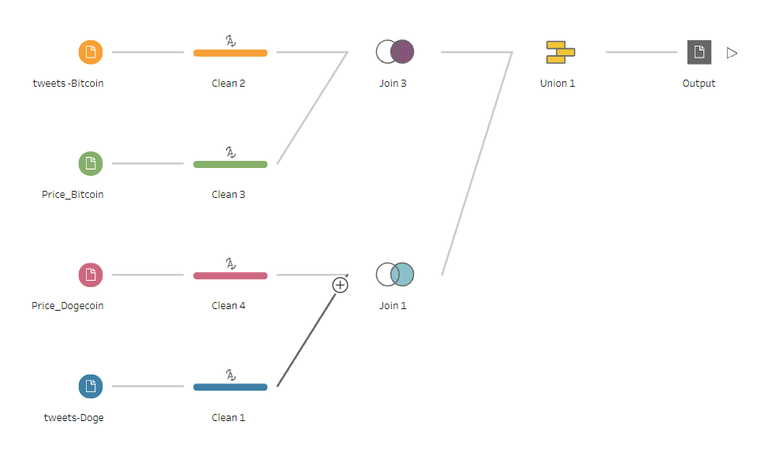

# Elon-Musk-s-effect-on-crypto-prices
This repo contains tweets scrapping code, crypto prices dataset &amp; Data Vizualization using Tableau Software.

### Project Parts:
* [Python script](https://github.com/bacembendaly99/Elon-Musk-s-effect-on-crypto-prices/blob/main/Tweets%20Scraping%20Script.ipynb) using Sncrape to extract Tweets(date,username,content,likeCount, retweetCount). Roberta Model applied for sentimental analysis in the second phase.
You can run the code on Colab [here](https://colab.research.google.com/drive/1GYWuWS2pdiCGLl3kq2sMJzonaH0mNXlv?usp=sharing)
* Tableau Data Prep Flow File  
* Tableau Packaged NoteBook which contains different